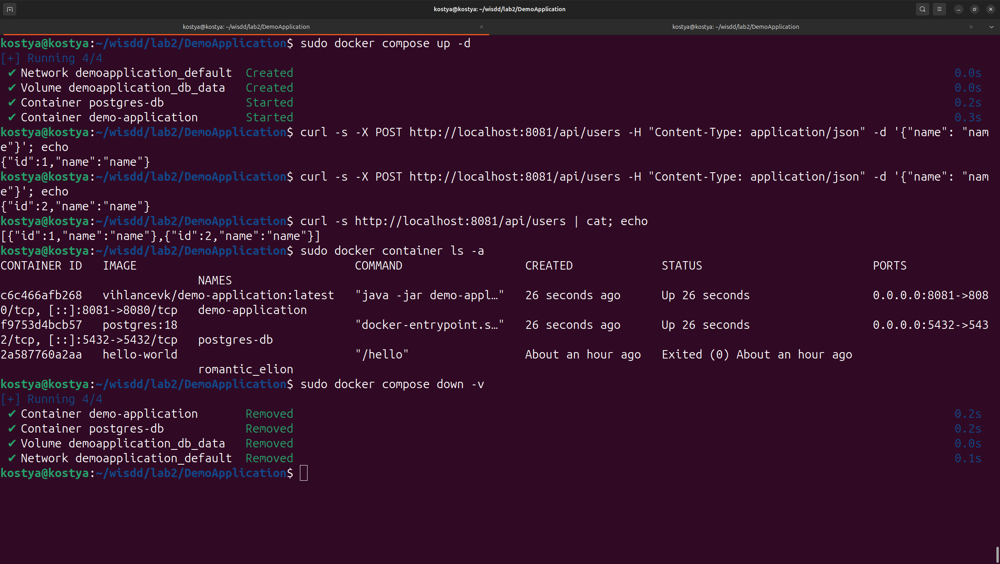

# DemoApplication

## Requirements
- Java 21.0.8
- Maven 3.8.7

## Build and Deployment

### Build application and Docker image
```bash
mvn package
sudo docker build -t demo-application:latest .
```

### Push to Docker Registry
```bash
sudo docker login
sudo docker tag demo-application:latest <username>/demo-application:latest
sudo docker push <username>/demo-application:latest
```

### Run with Docker Compose
```bash
sudo docker compose up -d
sudo docker compose down
```

