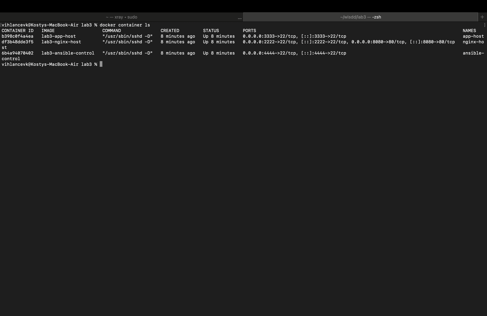
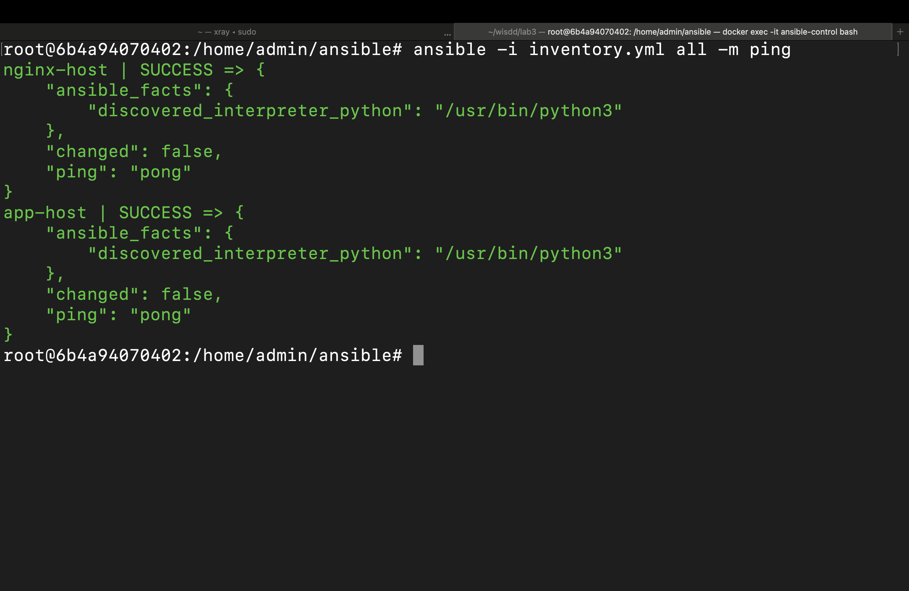
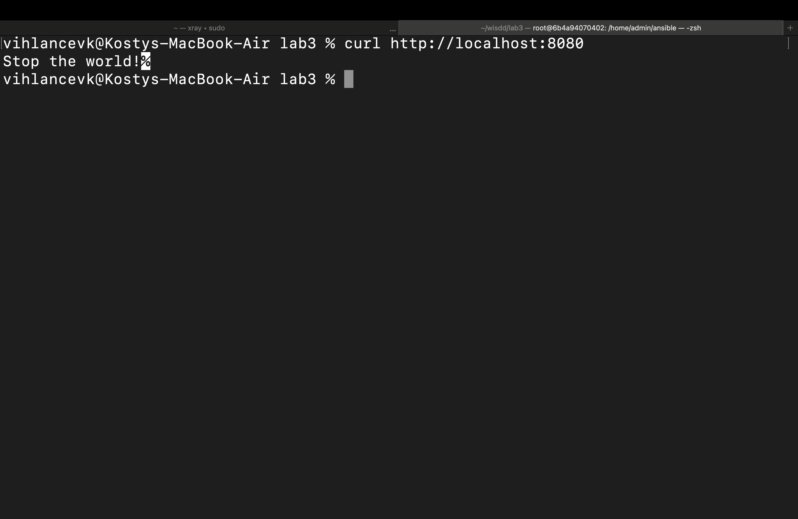

# Лабораторная работа №3

## Сборка

```shell
docker compose up -d
```


## Запуск

```shell
docker exec -it ansible-control bash
ansible -i inventory.yml all -m ping
ansible-playbook -i inventory.yml playbook.yml
exit
```


## Проверка

```shell
curl http://localhost:8080
```

