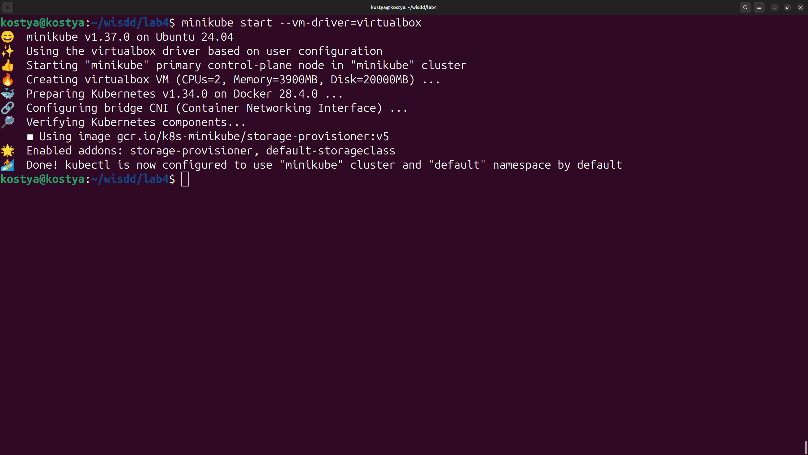
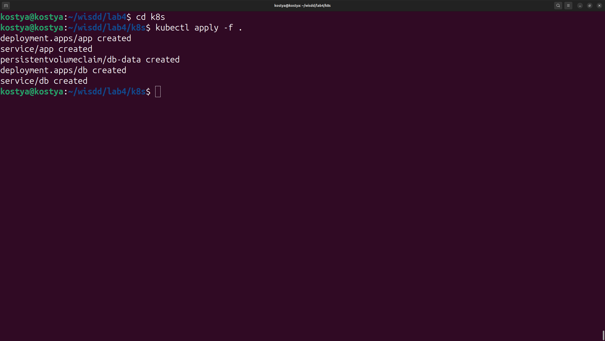
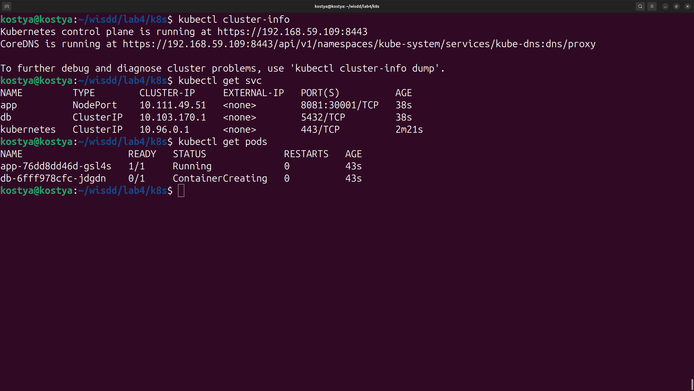
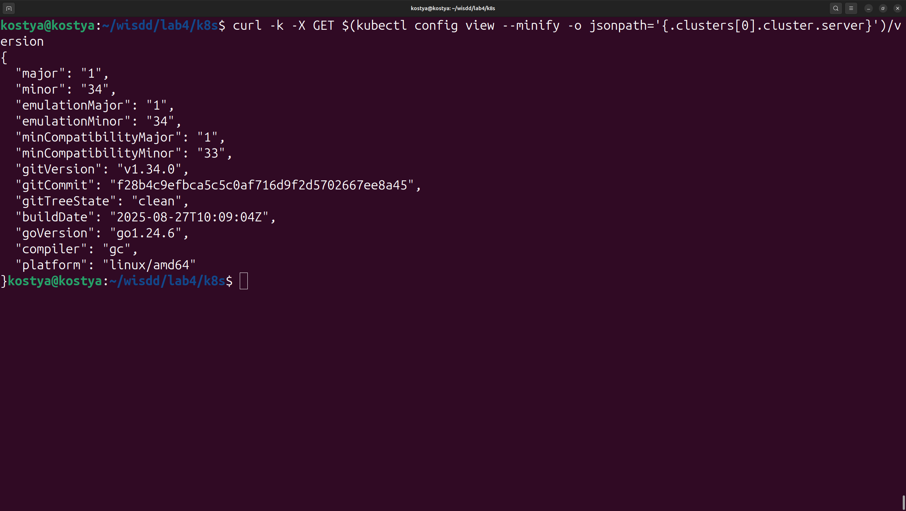
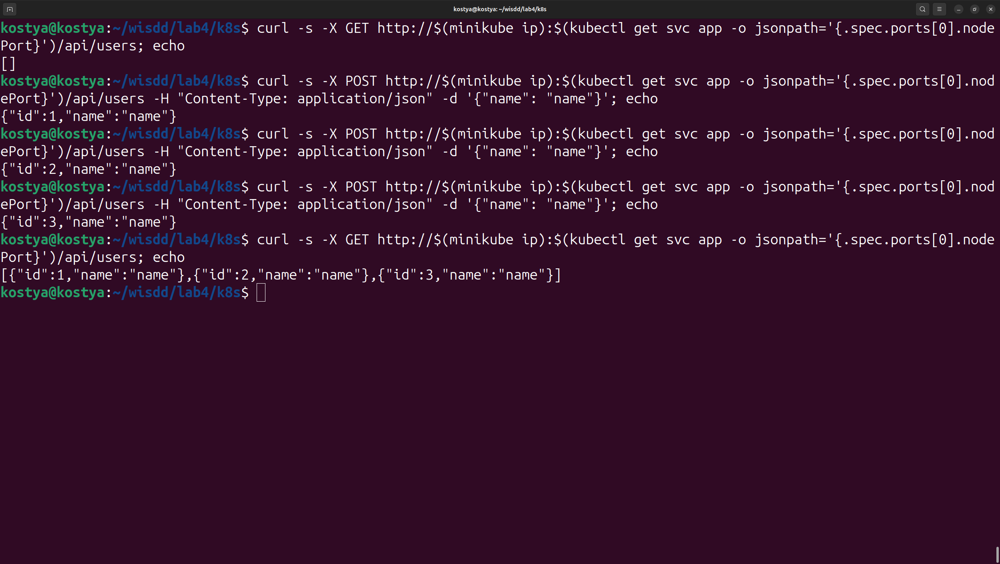
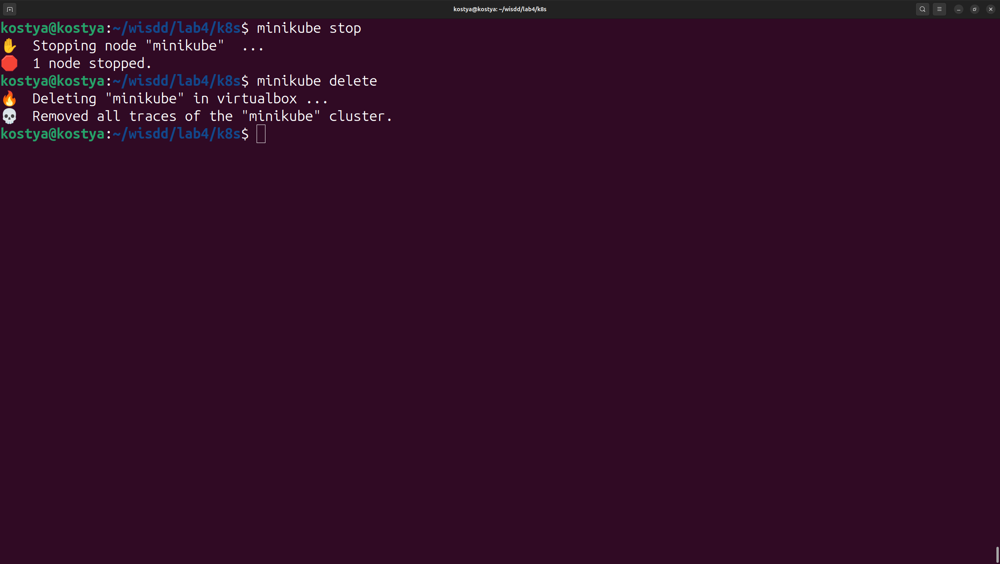

# Kubernetes Minikube Deployment Guide

A simple guide to deploy and test a sample application on Minikube.

## Prerequisites

- VirtualBox installed
- Minikube installed
- kubectl configured

## Quick Start

### 1. Start Minikube Cluster

```bash
minikube start --vm-driver=virtualbox
```



### 2. Deploy Application

```bash
cd k8s
kubectl apply -f .
```



### 3. Verify Deployment

```bash
kubectl cluster-info
kubectl get svc
kubectl get pods
```



### 4. Test Kubernetes API

```bash
curl -k -X GET $(kubectl config view --minify -o jsonpath='{.clusters[0].cluster.server}')/version
```



### 5. Test Application API

#### Get all users:

```bash
curl -s -X GET http://$(minikube ip):$(kubectl get svc app -o jsonpath='{.spec.ports[0].nodePort}')/api/users; echo
```

#### Create new user:

```bash
curl -s -X POST http://$(minikube ip):$(kubectl get svc app -o jsonpath='{.spec.ports[0].nodePort}')/api/users -H "Content-Type: application/json" -d '{"name": "name"}'; echo
```



### 6. Cleanup
```bash
minikube stop
minikube delete
```



## Notes

- The application is deployed from YAML files in the k8s/ directory
- Service is exposed on a NodePort for testing
- Make sure all pods are running before testing the API endpoints
